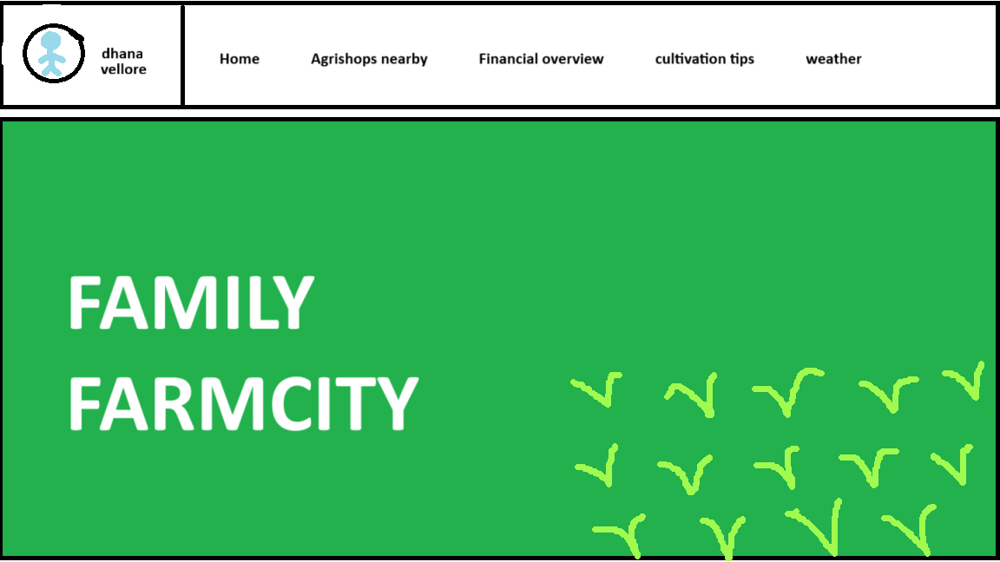

# Smart India Hackathon Workshop
# Date:30/09/2025
## Register Number:25016333
## Name:Dhanavishni M
## Problem Title
SIH 25010: Smart Crop Advisory System for Small and Marginal Farmers
## Problem Description
A majority of small and marginal farmers in India rely on traditional knowledge, local shopkeepers, or guesswork for crop selection, pest control, and fertilizer use. They lack access to personalized, real-time advisory services that account for soil type, weather conditions, and crop history. This often leads to poor yield, excessive input costs, and environmental degradation due to overuse of chemicals. Language barriers, low digital literacy, and absence of localized tools further limit their access to modern agri-tech resources.

Impact / Why this problem needs to be solved

Helping small farmers make informed decisions can significantly increase productivity, reduce costs, and improve livelihoods. It also contributes to sustainable farming practices, food security, and environmental conservation. A smart advisory solution can empower farmers with scientific insights in their native language and reduce dependency on unreliable third-party advice.

Expected Outcomes

• A multilingual, AI-based mobile app or chatbot that provides real-time, location-specific crop advisory.
• Soil health recommendations and fertilizer guidance.
• Weather-based alerts and predictive insights.
• Pest/disease detection via image uploads.
• Market price tracking.
• Voice support for low-literate users.
• Feedback and usage data collection for continuous improvement.

Relevant Stakeholders / Beneficiaries

• Small and marginal farmers
• Agricultural extension officers
• Government agriculture departments
• NGOs and cooperatives
• Agri-tech startups

Supporting Data

• 86% of Indian farmers are small or marginal (NABARD Report, 2022).
• Studies show ICT-based advisories can increase crop yield by 20–30%.

## Problem Creater's Organization
Government of Punjab

## Theme
Agriculture, FoodTech & Rural Development

## Proposed Solution

  
## Technical Approach
<h3>Technologies to be Used</h3>

Frontend: React Native / Flutter (for multilingual mobile app)

Backend: Node.js / Django with RESTful APIs

AI/ML Models: TensorFlow / PyTorch for pest detection, NLP for chatbot, and recommendation models

Databases: PostgreSQL / MongoDB

Cloud Infrastructure: AWS / Azure for scalability

Integration: Weather APIs, soil health databases, government crop datasets

Methodology & Process

Data Collection & Integration – Soil, weather, crop, and market datasets.

AI Model Development – Pest/disease detection via image recognition, NLP for chatbot queries, and predictive analytics for yield and input optimization.

App Development – Multilingual support, voice assistant, offline functionality.

Pilot Testing – Limited farmer groups in Punjab.

Scaling & Iteration – Expansion to wider geographies with continuous model improvement.

## Feasibility and Viability
<h3>Feasibility</h3>

High mobile penetration in rural India enables digital adoption.

Government and NGO partnerships can aid outreach and trust-building.

Cloud-based AI solutions make the system scalable and cost-effective.

Potential Challenges & Risks

Low digital literacy among farmers.

Limited internet access in remote areas.

Resistance to change from traditional practices.

Strategies to Overcome Challenges

Provide voice-based navigation and local language interfaces.

Enable offline advisory mode with periodic sync.

Conduct community training and demonstrations to build trust.
Viability
Economic: MVP can be developed within reasonable cost (INR 25–40 lakhs) and sustained via government support, agritech partnerships, and premium services.

Social: Farmers benefit through higher yield, reduced costs, and sustainable practices; multilingual and voice-first features ensure inclusivity.

Scalability: Cloud-native design and multi-channel delivery allow expansion across regions.
## Impact and Benefits
<h3>Potential Impact</h3>

Increased crop yield and reduced input costs.

Improved farmer income and livelihoods.

Strengthened rural digital ecosystem.

Benefits

Social: Empowerment of farmers through knowledge access.

Economic: Reduced input waste, higher productivity, better market access.

Environmental: Sustainable farming with reduced chemical overuse.

## Research and References
<h3>research and references</h3>
NABARD Report (2022): 86% of Indian farmers are small or marginal.

Studies on ICT advisories: Yield increase by 20–30% with digital guidance.

FAO & World Bank reports on sustainable agriculture practices.
